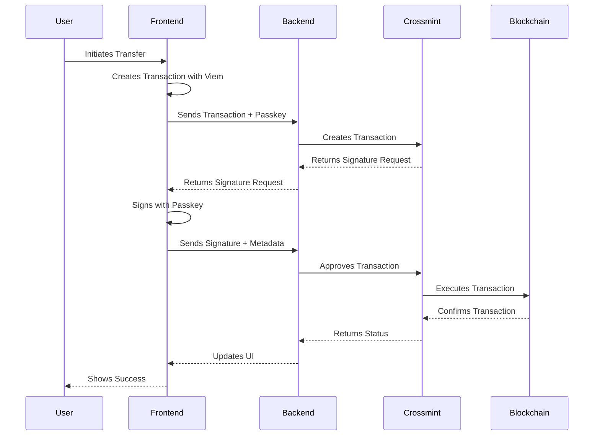

# Crossmint Wallets API Demo

This is a demonstration project showcasing the integration of Crossmint's Wallets API with passkey authentication. This demo is for educational purposes and **should not be used in production without proper security measures**.

## ⚠️ Important Security Notes

- This is a demo application and is not production-ready
- Never expose your Crossmint server API key on the client side
- All Crossmint API calls should be wrapped through your backend endpoints
- Proper error handling and security measures should be implemented for production use

## Features

### 1. Wallet Creation with Passkeys

- Create multiple wallets using a single passkey
- Each wallet is associated with a unique passkey credential
- Utilizes the [Create Wallet API](https://docs.crossmint.com/api-reference/wallets/create-wallet)
- Passkeys and wallet addresses persist in localStorage

### 2. Wallet Funding

- Fund wallets using test tokens
- Implements the [Fund Wallet API](https://docs.crossmint.com/api-reference/wallets/fund-wallet)
- Supports various tokens and chains (demo uses USDXM on Base Sepolia)

### 3. Transaction Management

- View all wallet transactions
- Create new token transfer transactions
- Uses [Get Transactions API](https://docs.crossmint.com/api-reference/wallets/get-transaction)
- Implements [Create Transaction API](https://docs.crossmint.com/api-reference/wallets/create-transaction)
- Supports [Transaction Approval API](https://docs.crossmint.com/api-reference/wallets/approve-transaction)

## Transaction Flow Diagram



## Technical Details

### Passkeys

- Uses [WebAuthn](https://oxlib.sh/guides/webauthn) for secure key generation and signing
- Credentials are stored locally in the browser
- Each passkey can manage multiple wallets
- No server-side storage of private keys

### Token Transactions

- Uses [Viem](https://viem.sh/) for transaction creation and RPC interactions
- **Note**: You must provide your own RPC provider for production use
- Supports ERC20 token transfers (demo uses USDXM)

## Getting Started

1. Clone the repository
2. Create a `.env.local` file with the following variables:

```env
API_BASE_URL=https://api.crossmint.com/api/v1-alpha1/
API_ALPHA_V2_BASE_URL=https://api.crossmint.com/api/v1-alpha2/
WALLETS_API_KEY=your_api_key_here
NEXT_PUBLIC_RPC_URL=your_rpc_url_here
```

3. Install dependencies:

```bash
pnpm install
```

4. Run the development server:

```bash
pnpm dev
```

## Project Structure

- `/app` - Next.js app router pages and API routes
- `/components` - React components for UI
- `/lib` - Utility functions and API wrappers
- `/providers` - React context providers
- `/hooks` - Custom React hooks

## Dependencies

- Next.js 14
- React 18
- Viem for Ethereum interactions
- Shadcn/ui for UI components
- WebAuthn for passkey management

## Security Considerations for Production

1. Implement proper authentication and authorization
2. Secure API key management
3. Rate limiting and request validation
4. Error handling and logging
5. Secure session management
6. Input validation and sanitization
7. CORS configuration
8. SSL/TLS encryption
